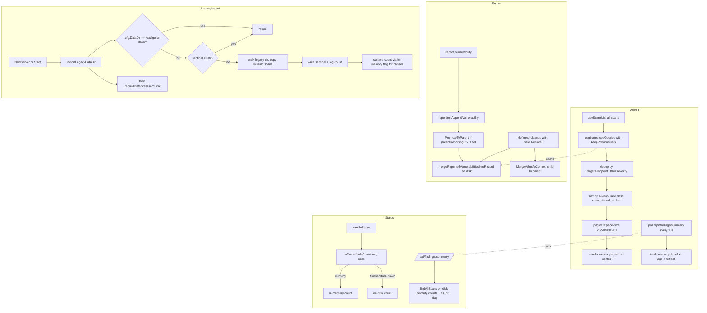

# Findings Consistency and Pagination Bugfix Design

## Overview

The Findings dashboard exhibits four interacting defects that surface to the
user as the same complaint: "findings keep disappearing." This design
addresses each root cause independently while ensuring the fixes compose
without regressions.

The four root causes, mapped onto the four sections of this design:

- **A. UI: pagination + de-flicker.** `webui/src/pages/findings.tsx` and
  `webui/src/pages/overview.tsx` both hard-cap the number of scans they
  consult (`slice(0, 30)` and `slice(0, 50)` respectively), and the
  `useQueries` reducer treats a sub-query in `isFetching` state as if its
  data were absent, dropping that scan's contribution to zero during refetch.
- **B. Server: stable counter source.** `inst.VulnCount` is updated from
  three different sources at three different points in the scan lifecycle
  (`server.go:2816`, `:3174`, `:3176`), so the counter visibly jumps as the
  scan transitions between phases.
- **C. Server: panic-safe persistence and parent merge.**
  `mergeReportedVulnerabilitiesIntoRecord` and `MergeVulnsToContext` only run
  at session finalization, so a child scan that panics loses its already-
  reported findings from the parent aggregate. The triggering panic itself
  (`runtime error: slice bounds out of range`) lives in the agent's prune
  helpers around `internal/agent/agent.go:1351` and `:1407`.
- **D. Legacy data import.** Findings on disk under the legacy
  `~/xalgorix-data/` directory are invisible to the post-migration server,
  amplifying the "data disappears" perception.

The fix strategy is conservative: pagination is added as new UI surface, the
counter source is consolidated through one helper, the merge calls are moved
into `cleanup()` with `safe.Recover` guards, and the legacy import is a
sentinel-gated, copy-only, idempotent operation.

## Glossary

- **Bug_Condition (C)**: The condition that triggers the bug — any input or
  state combination that causes findings to be missing, miscounted, or
  flickering on the dashboard.
- **Property (P)**: The desired behavior under C — every finding from every
  scan on disk is displayed (subject to user-controlled pagination), counters
  are monotonic-non-decreasing per session, and findings persist across agent
  panics.
- **Preservation**: Existing UI interactions (search, filter, single/bulk
  delete, scan launch/stop/pause, scan detail polling, navigation) and
  on-disk record formats that must remain unchanged by the fix.
- **`useScansList()`**: The existing WebUI hook (`webui/src/hooks/`) that
  returns the full list of scan IDs known to the server.
- **`useQueries` reducer**: The TanStack Query hook in `findings.tsx` that
  fans out per-scan detail queries and reduces them into a flat finding list.
- **`findAllScans()`**: The Go function in `internal/web/server.go` that
  walks `cfg.DataDir` and returns every persisted `ScanRecord`.
- **`reporting.GetVulnerabilitiesForContext(ctxID)`**: In-memory store
  accessor; wiped by `reporting.CleanupContext` on teardown.
- **`mergeReportedVulnerabilitiesIntoRecord(record, ...)`**: Persists
  reported vulnerabilities from the in-memory store into the on-disk record.
- **`MergeVulnsToContext(childCtxID, parentCtxID)`**: Copies a child's
  in-memory vulnerabilities into the parent's reporting context.
- **`inst.VulnCount`**: The per-instance counter displayed in `/api/status`.
- **`parentReportingCtxID`**: The reporting context of the parent scan
  session, set on a child session when the scan is launched as a sub-scan.
- **`cfg.DataDir`**: The post-migration data directory, defaults to
  `~/.xalgorix/data/`.
- **Legacy data dir**: `~/xalgorix-data/`, the pre-migration data location.
- **Severity rank**: The numeric ordering critical > high > medium > low >
  info used for sorting the union finding list.

## Bug Details

### Bug Condition

The bug manifests as four overlapping conditions, each producing the same
user-visible symptom of disappearing findings. The unifying formal condition
is: a finding F that exists on disk, or was successfully reported via
`report_vulnerability`, is not visible on the Findings dashboard at the
moment the user looks at it.

**Formal Specification:**

```
FUNCTION isBugCondition(state)
  INPUT: state of type DashboardState containing
           scansOnDisk: list of ScanRecord,
           legacyScansOnDisk: list of ScanRecord (under ~/xalgorix-data/),
           reportedBeforePanic: list of Vulnerability,
           inMemoryCounters: map[scanID]int,
           visibleFindings: list of Finding,
           visibleTotal: int
  OUTPUT: boolean

  // A. Truncation: more than 30 scans on disk, but only the first 30 are queried.
  IF len(scansOnDisk) > 30 AND
     visibleFindings does NOT include findings from scansOnDisk[30:] THEN
    RETURN true
  END IF

  // A. Flicker: a sub-query is refetching and its prior data was discarded.
  IF EXISTS scanID WHERE inMemoryCounters[scanID] was previously > 0 AND
     visibleTotal dropped during refetch with no delete event THEN
    RETURN true
  END IF

  // B. Counter source instability: counter source switched mid-scan.
  IF inst.VulnCount was sourced from len(inst.Vulns) at t1 AND
     from len(reporting.GetVulnerabilitiesForContext(parentCtxID)) at t2 AND
     from len(reporting.GetVulnerabilitiesForContext(sess.sctx.ID)) at t3 THEN
    RETURN true
  END IF

  // C. Panic-induced loss: vulnerabilities reported before panic missing.
  IF agent panicked at time tp AND
     EXISTS v IN reportedBeforePanic WHERE
       v NOT IN parentRecord.Vulns AFTER cleanup(sess) completes THEN
    RETURN true
  END IF

  // C. Slice-cutoff panic: pruneMessages indexed past message buffer.
  IF len(a.messages) <= 1 AND pruneMessages or forcePruneMessages
     computed cutoff > len(a.messages) OR cutoff < 1 THEN
    RETURN true
  END IF

  // D. Legacy data invisibility: legacy scans not imported.
  IF legacyScansOnDisk is non-empty AND
     no sentinel file at cfg.DataDir/.legacy-imported AND
     visibleFindings excludes all legacy findings THEN
    RETURN true
  END IF

  RETURN false
END FUNCTION
```

### Examples

- **Truncation example.** User has 71 scans on disk under `cfg.DataDir`. The
  Findings page calls `useQueries` over `scanIds.slice(0, 30)`, so findings
  produced by scans 31–71 never appear. Expected: every scan participates,
  paginated with a default page size of 50.
- **Flicker example.** User loads the Findings page; counter shows
  "critical 3". Thirty seconds later, scan A's per-scan query enters
  `isFetching`. The `useQueries` reducer's `if (!rec?.vulns) return;`
  branch drops scan A's contribution to zero, the header re-renders to
  "critical 2", and a moment later refetch completes and it returns to
  "critical 3". Expected: counter stays at "critical 3" for the entire
  session in the absence of a delete.
- **Counter source jump example.** A live scan is in
  `phaseScanReport` and `inst.VulnCount` was just set from
  `len(reporting.GetVulnerabilitiesForContext(sess.sctx.ID))`. The session
  enters teardown, `reporting.CleanupContext` wipes the in-memory store, and
  the next status poll sees `inst.VulnCount = 0`. Expected: the counter is
  read from a single helper that prefers in-memory while running and on-disk
  after teardown.
- **Panic-induced loss example.** A child scan reports two vulnerabilities
  via `report_vulnerability`, then the agent panics with
  `runtime error: slice bounds out of range` inside `pruneMessages`. The
  deferred teardown runs, but `MergeVulnsToContext` is unreachable because
  it lives outside the deferred path. The parent's aggregate loses both
  findings. Expected: both findings are merged into the parent before the
  in-memory child context is released.
- **Slice-cutoff panic example.** `forcePruneMessages` computes
  `cutoff := len(a.messages) - keepLast` where `keepLast > len(a.messages)`,
  yielding a negative `cutoff`; the subsequent `a.messages = a.messages[cutoff:]`
  panics. Expected: cutoff is clamped to `[1, len(a.messages)]`.
- **Legacy data invisibility example.** A user upgraded to the post-migration
  server. They have 12 scans under `~/xalgorix-data/` and 3 under
  `~/.xalgorix/data/`. The Findings page shows 3 scans' worth of findings.
  Expected: on first start after the fix, the 12 legacy scans are copied
  forward, a banner reads "Imported 12 legacy scans from ~/xalgorix-data/",
  and the page shows all 15 scans' findings.

## Expected Behavior

### Preservation Requirements

**Unchanged Behaviors:**

- Mouse clicks on finding rows continue to navigate to the owning scan
  detail page exactly as before.
- The search box filters findings by title, endpoint, host, CVE, CWE, and
  OWASP fields with the existing case-insensitive substring match.
- The severity filter dropdown restricts visible findings via the existing
  `normalizeSeverity` mapping.
- Bulk delete and per-row delete continue to call
  `DELETE /api/scans/{scanId}/vulns/{vulnId}` with the existing confirmation
  prompt and selection-state invalidation.
- The scan detail page continues to poll every 2 seconds via `useScan(id)`
  with no change to its cadence.
- The scan launch, stop, and pause flows behave identically aside from the
  added crash-safe persistence and parent-merge-on-report changes required
  by clauses 2.4 and 2.5 of the requirements.
- Keyboard and mouse interactions on every page other than the Findings
  page and the Overview totals widget are untouched.
- The `ScanRecord` JSON shape on disk is unchanged.
- The `/api/status` shape is additive only — `vulns` keeps its existing
  semantics; `vulns_persisted` is new.

**Scope:**

All inputs that do NOT match `isBugCondition` should be completely
unaffected by this fix. This includes:

- Users with ≤ 30 scans on disk (the truncation arm of the bug never
  triggered for them).
- Scan sessions that finish cleanly (the panic arm of the bug never
  triggered).
- Servers where `~/xalgorix-data/` does not exist, is empty, or has already
  been imported (sentinel present).
- Every page other than `findings.tsx` and `overview.tsx`.
- Every agent code path other than the prune helpers in `agent.go`.

## Hypothesized Root Cause

Each of the four sub-bugs has its own root cause; they are independent and
all four must be fixed.

1. **Hardcoded slice + naive `useQueries` reducer (A).**
   - `findings.tsx` calls `scanIds.slice(0, 30)` before fanning out per-scan
     queries, capping the dataset at 30 scans regardless of disk content.
   - `overview.tsx` does the same with `slice(0, 50)` for the totals widget.
   - The `useQueries` reducer aborts a scan's contribution with
     `if (!rec?.vulns) return;` whenever the per-scan query is in
     `isFetching` with no fresh data, instead of falling back to the prior
     successful result. With `staleTime: 30_000`, this happens every 30s.

2. **Triple-source `inst.VulnCount` (B).**
   - `server.go:2816` sets `inst.VulnCount = len(inst.Vulns)`.
   - `server.go:3174` sets it from
     `len(reporting.GetVulnerabilitiesForContext(parentReportingCtxID))`.
   - `server.go:3176` sets it from
     `len(reporting.GetVulnerabilitiesForContext(sess.sctx.ID))`.
   - The three sources go out of sync as the scan moves between phases and
     between child sessions, producing the visible jumps.
   - Compounding this, `handleStatus` always reads from the in-memory store,
     which is wiped during teardown — so finished and panicking scans drop
     to zero on the dashboard.

3. **Merge-at-finalization + unguarded panic path (C).**
   - `mergeReportedVulnerabilitiesIntoRecord(sess.record, ...)` runs only
     once at session end, not on each `report_vulnerability` call.
   - `MergeVulnsToContext(sess.sctx.ID, parentReportingCtxID)` is called
     in the same finalization block, outside the deferred `cleanup()`.
   - When the agent panics, the deferred `cleanup()` runs but the merge
     calls do not, so already-reported findings are dropped.
   - The trigger panic itself is in `internal/agent/agent.go` around lines
     1351 (`pruneMessages`) and 1407 (`forcePruneMessages`); the cutoff
     arithmetic does not guard against `cutoff > len(a.messages)` or
     `cutoff < 1`, so short message buffers panic.

4. **No legacy import (D).**
   - `NewServer` calls `rebuildInstancesFromDisk()` against `cfg.DataDir`
     only. The pre-migration data location `~/xalgorix-data/` is never
     consulted, so any user who upgraded after generating data sees an
     empty (or near-empty) Findings page.

## Correctness Properties

Property 1: Bug Condition - Findings page enumerates every scan on disk

_For any_ set of scan IDs returned by `useScansList()` (regardless of
cardinality, including N > 30 and N > 50), the Findings page and the
Overview totals widget SHALL include every scan's findings in their
respective views, subject only to user-controlled pagination, search, and
severity filtering. After dedup by `(target, endpoint, title, severity)`,
the union finding list SHALL equal the union of findings across all scans
returned by `findAllScans()`.

**Validates: Requirements 2.1, 2.8**

Property 2: Bug Condition - Counter monotonicity per page session

_For any_ sequence of background refetches and teardown events occurring
during a page session in which the user performs no delete actions, the
visible severity counters and the page-level total SHALL be
monotonic-non-decreasing. No refetch, panic, or session teardown SHALL
cause a visible decrease.

**Validates: Requirements 2.2, 2.3, 2.5**

Property 3: Bug Condition - Pagination partition

_For any_ page size in `[25, 50, 100, 200]` and any union finding list of
length L, every finding SHALL appear on exactly one page, page indices
SHALL be `1..ceil(L/pageSize)`, and concatenation of pages in order SHALL
equal the union finding list in its sorted order (severity rank desc,
then `scan_started_at` desc).

**Validates: Requirements 2.6**

Property 4: Bug Condition - Panic-safe persistence

_For any_ vulnerability v successfully appended to a child session's
reporting context via `report_vulnerability` at time t_report, and for
any agent panic at time t_panic > t_report, after the deferred
`cleanup()` completes v SHALL be present in both:

- the child's on-disk `scan.json` (via
  `mergeReportedVulnerabilitiesIntoRecord` running inside `cleanup()`), and
- the parent's reporting context and the parent's on-disk `Vulns` slice
  (via `PromoteToParent` running on each report, plus
  `MergeVulnsToContext` running inside `cleanup()`).

**Validates: Requirements 2.4**

Property 5: Bug Condition - Slice-cutoff guard

_For any_ message buffer `a.messages` of length n ≥ 0 and any
`keepLast` value, both `pruneMessages` and `forcePruneMessages` SHALL
return without panic. The post-call invariants are:
`1 ≤ cutoff ≤ len(a.messages)` whenever the buffer is non-empty, and the
helpers are no-ops when the buffer is empty or has length 1.

**Validates: Requirements 2.4**

Property 6: Bug Condition - Legacy import idempotence

_For any_ filesystem state under `~/xalgorix-data/` and `cfg.DataDir`,
running `importLegacyDataDir()` twice in succession SHALL produce the
exact same destination state as running it once: the same set of scan
IDs under `cfg.DataDir`, the same sentinel file at
`cfg.DataDir/.legacy-imported`, and the same banner count surfaced once
to the WebUI on the first run and never on subsequent runs. If
`cfg.DataDir == ~/xalgorix-data/`, the function SHALL return early and
write nothing.

**Validates: Requirements 2.7, 3.10**

Property 7: Preservation - Non-buggy inputs unchanged

_For any_ input where `isBugCondition` returns false (≤ 30 scans on disk,
no panic, no legacy data, no refetch race), the fixed code SHALL produce
the same Findings page contents, the same `/api/status` `vulns` value,
the same scan-detail polling cadence, the same search/filter/delete
behavior, the same scan launch/stop/pause flows, and the same on-disk
`ScanRecord` shape as the original code, preserving all existing
functionality for non-buggy interactions.

**Validates: Requirements 3.1, 3.2, 3.3, 3.4, 3.5, 3.6, 3.7, 3.8, 3.9**

## Fix Implementation

### Architecture Diagram



### A. UI: pagination + de-flicker

**File**: `webui/src/pages/findings.tsx`

**Function**: top-level findings page component and its `useQueries` reducer.

**Specific Changes**:

1. **Remove the 30-scan cap.** Replace `scanIds.slice(0, 30)` with the full
   `scanIds` list returned by `useScansList()`.
2. **Per-query `keepPreviousData: true`.** Pass `keepPreviousData: true` in
   each per-scan query option so refetch transitions retain prior data
   instead of returning `undefined`.
3. **Reducer fix.** Replace `if (!rec?.vulns) return;` with a fallback to
   the query's `data` (which TanStack Query keeps populated when
   `keepPreviousData` is set). When the data is genuinely absent (initial
   load), skip the scan; otherwise reuse the prior value.
4. **Union + dedup helper.** Add
   `dedupFindings(findings: Finding[]): Finding[]` that flattens findings
   across all loaded scans, dedups by `(target, endpoint, title, severity)`,
   sorts by severity rank desc then `scan_started_at` desc, and preserves
   each row's owning scan id for delete and navigation. Place in
   `webui/src/lib/findings.ts` so it is unit-testable in isolation.
5. **Pagination control.** New component
   `webui/src/components/Pagination.tsx` rendering Prev / 1 … N / Next plus
   a page-size selector with `[25, 50, 100, 200]` and default 50. Page
   state lives in local component state synced to URL query params
   `?page=` and `?size=` (recommended, not required for first cut).
6. **Virtualization (if dependency present).** If
   `@tanstack/react-virtual` is already a dependency, wrap the rendered
   page in a virtualized list for page sizes ≥ 100. If not present, render
   the page directly without virtualization. Do not add the dependency in
   this fix.
7. **Updated indicator + manual refresh.** Add an "updated Xs ago"
   timestamp and a refresh button to the totals row. The timestamp comes
   from the `as_of` field returned by `/api/findings/summary` (see B).
   Refresh invalidates the relevant queries.

**File**: `webui/src/pages/overview.tsx`

**Specific Changes**:

1. **Remove the 50-scan cap.** Replace `scanIds.slice(0, 50)` with the full
   `scanIds` list, mirroring the findings.tsx changes 1–3 above for the
   totals widget. The Overview page does not get pagination, but it gets
   the de-flicker fix and the same `keepPreviousData` treatment.

### B. Server: stable counter source

**File**: `internal/web/server.go`

**Function**: new `effectiveVulnCount` helper plus updates to `handleStatus`
and to every `inst.VulnCount = ...` assignment.

**Specific Changes**:

1. **New helper.**
   ```go
   func (s *Server) effectiveVulnCount(inst *ScanInstance, sess *scanSession) int
   ```
   Returns the in-memory count from
   `reporting.GetVulnerabilitiesForContext(sess.sctx.ID)` (preferring
   `parentReportingCtxID` when the session is a child) when the scan is
   actively running, and the on-disk count from `len(record.Vulns)` (loaded
   via the existing record cache) otherwise.
2. **Replace the three triple-source assignments.** At `server.go:2816`,
   `:3174`, and `:3176`, replace each direct assignment with
   `inst.VulnCount = s.effectiveVulnCount(inst, sess)`.
3. **`handleStatus` additive change.** `handleStatus` keeps its existing
   `vulns` field (in-memory total) and adds a new `vulns_persisted` field
   computed via the same on-disk source as the new
   `/api/findings/summary` endpoint. Consumers can then opt into the
   stable value without breaking existing clients.
4. **New endpoint `/api/findings/summary`.** Returns:
   ```json
   {
     "totals": {"critical": 0, "high": 0, "medium": 0, "low": 0, "info": 0},
     "as_of": "<RFC3339>",
     "etag": "<hash of totals>"
   }
   ```
   Implementation walks `findAllScans()` and counts severities. Polled by
   the WebUI every 10s. Etag enables cheap 304 responses.

### C. Server: panic-safe persistence + parent merge

**Files**: `internal/web/server.go`, `internal/reporting/`,
`internal/agent/agent.go`.

**Specific Changes**:

1. **Move merges into `cleanup()`.** In the scan-session orchestration
   block, move both
   `mergeReportedVulnerabilitiesIntoRecord(sess.record, ...)` and
   `MergeVulnsToContext(sess.sctx.ID, parentReportingCtxID)` from the
   finalization block into the deferred `cleanup()` closure. Wrap each
   call in `safe.Recover` so a panic inside one does not skip the other:
   ```go
   defer func() {
     safe.Recover(func() {
       mergeReportedVulnerabilitiesIntoRecord(sess.record, /* ... */)
     })
     safe.Recover(func() {
       if parentReportingCtxID != "" {
         reporting.MergeVulnsToContext(sess.sctx.ID, parentReportingCtxID)
       }
     })
   }()
   ```
   Both functions are idempotent today (each entry is keyed by vuln id);
   confirm and document the idempotence as part of this fix.
2. **`reporting.PromoteToParent` (new).**
   ```go
   func PromoteToParent(childCtxID, parentCtxID string, vulnID string)
   ```
   Adds one vulnerability to the parent's reporting context if not already
   present (by id). Wrap the existing `report_vulnerability` call site so
   each successful append also invokes `PromoteToParent` when
   `parentReportingCtxID != ""`. This guarantees the parent aggregate is
   updated incrementally and survives a child panic even if
   `MergeVulnsToContext` could not run.
3. **Slice-cutoff guard in agent prune helpers.** In
   `internal/agent/agent.go`, find the cutoff arithmetic in
   `pruneMessages` (around line 1351) and `forcePruneMessages` (around
   line 1407). Add:
   ```go
   if cutoff < 1 {
     cutoff = 1
   }
   if cutoff > len(a.messages) {
     cutoff = len(a.messages)
   }
   if len(a.messages) <= 1 {
     return
   }
   ```
   immediately before `a.messages = a.messages[cutoff:]`. The function
   becomes a no-op for buffers of length 0 or 1.
4. **Regression test (Go).** Add table-driven tests in
   `internal/agent/agent_prune_test.go` that construct message buffers of
   length 0 and 1 and verify both `pruneMessages` and `forcePruneMessages`
   return without panic. Add a property test (when the project's PBT
   harness is in place) that asserts no panic for buffers of length n in
   `[0, 256]` and arbitrary `keepLast` values.

### D. Legacy data import

**File**: `internal/web/server.go`

**Function**: new `importLegacyDataDir()` plus a one-line wire-up in
`NewServer` (or `Start`).

**Specific Changes**:

1. **Add `importLegacyDataDir()`.**
   ```go
   func (s *Server) importLegacyDataDir() (count int, err error)
   ```
   Behavior:
   - Compute legacy path `filepath.Join(home, "xalgorix-data")`.
   - Return `(0, nil)` if `cfg.DataDir == legacyPath` (legacy IS active).
   - Return `(0, nil)` if a sentinel file
     `filepath.Join(cfg.DataDir, ".legacy-imported")` exists.
   - Walk `legacyPath` for `*/scan.json` (matching both
     `<target>/<date>/<scan-id>/scan.json` and the legacy flat shape).
   - For each found record, parse the `id`. If a record with that id is
     not already present under `cfg.DataDir`, copy the entire scan
     directory (recursively) to
     `filepath.Join(cfg.DataDir, target, date, scanID)`.
   - On completion (or first-run skip path that wrote nothing), write the
     sentinel file and log
     `[legacy-import] imported %d scans from %s`.
2. **Wire-up.** Call `importLegacyDataDir()` once in `NewServer` (or
   `Start`) immediately before `rebuildInstancesFromDisk()`. Failures are
   logged and non-fatal; the server continues to start.
3. **Banner state.** Store the imported `count` on the `Server` struct in
   memory (no persistence). Expose via a transient endpoint
   `/api/legacy-import/status` returning
   `{"count": N, "dismissed": false}` once. The WebUI reads this on first
   load and renders a dismissible banner:
   "Imported N legacy scans from `~/xalgorix-data/`. Click to review or
   dismiss." When the user dismisses, the WebUI flips `dismissed` for the
   remainder of the server process; restart re-shows once. Dismissal is
   intentionally not persisted because the count is only meaningful on
   the run that did the import.
4. **Migration story.** The legacy import IS the migration. No data loss,
   no automatic deletion of `~/xalgorix-data/`. Document in `CHANGELOG.md`
   that the user can manually `rm -rf ~/xalgorix-data` after verifying
   the import. This is intentionally a manual step.

## Testing Strategy

### Validation Approach

The testing strategy follows the standard two-phase bugfix approach: first,
surface counterexamples that demonstrate each of the four sub-bugs on
unfixed code; then verify each fix works correctly and preserves existing
behavior. The test focus is Go unit tests (where the highest-value
invariants live) plus a thin layer of UI tests that confirm the pagination
control renders and switches counts. Per the user's Quick Plan preference,
property-based tests are documented but their implementation is deferred —
properties P1–P7 are listed for future PBT work.

### Exploratory Bug Condition Checking

**Goal**: Surface counterexamples that demonstrate each sub-bug BEFORE
implementing the fix. Confirm or refute the root cause analysis. If we
refute, re-hypothesize.

**Test Plan**: Construct fixtures and reproductions for each root cause
and run them against the unfixed code. Each test in this section is
expected to FAIL on the unfixed code and PASS after the fix.

**Test Cases**:

1. **Truncation reproduction (A).** Seed `cfg.DataDir` with 71 scan
   directories, render the Findings page, assert findings from scans 31–71
   are present. (Will fail on unfixed code: `slice(0, 30)` cap.)
2. **Flicker reproduction (A).** Render the Findings page with two scans
   showing 3 critical findings total. Force one per-scan query into
   `isFetching` while the other is fresh. Assert the rendered total
   stays at 3. (Will fail on unfixed code: `if (!rec?.vulns) return;`
   drops the contribution to zero.)
3. **Counter source jump reproduction (B).** Drive a scan through phases
   `phaseScanReport → finalize → cleanup` and snapshot
   `inst.VulnCount` at each transition. Assert the value is monotonic
   non-decreasing. (Will fail on unfixed code: triple-source assignments
   produce visible jumps.)
4. **Panic-induced loss reproduction (C).** Construct a child scan
   session, call `report_vulnerability` twice, inject a panic in the
   agent goroutine, allow the deferred cleanup to run, and assert both
   reported vulnerabilities are present in the parent's `Vulns` slice
   on disk and in the parent's reporting context in memory. (Will fail
   on unfixed code: `MergeVulnsToContext` outside `cleanup()`.)
5. **Slice-cutoff panic reproduction (C).** Call `forcePruneMessages` on
   a single-message buffer with `keepLast` larger than the buffer.
   Assert no panic. (Will fail on unfixed code: negative cutoff into
   slice.)
6. **Legacy data invisibility reproduction (D).** Seed
   `~/xalgorix-data/` with 12 scans, leave `cfg.DataDir` empty, start the
   server, and assert all 12 scans are visible on the Findings page.
   (Will fail on unfixed code: legacy path never read.)

**Expected Counterexamples**:

- (A) Findings from scans 31–71 absent; total drops from 3 to 2 during
  refetch.
- (B) `inst.VulnCount` flips between three values within a single scan
  lifecycle.
- (C) Parent's `Vulns` slice missing two entries that were successfully
  appended before the panic.
- (C) `panic: runtime error: slice bounds out of range [-1:]` from
  `forcePruneMessages`.
- (D) Findings page shows 0 scans despite 12 scans on disk under the
  legacy path.

Possible causes (already analyzed in the Hypothesized Root Cause section):
hardcoded slice, naive `useQueries` reducer, triple-source counter,
finalization-only merge, slice-cutoff arithmetic, missing legacy walker.

### Fix Checking

**Goal**: Verify that for all inputs where the bug condition holds, the
fixed function produces the expected behavior.

**Pseudocode:**

```
FOR ALL state WHERE isBugCondition(state) DO
  applyFix(state)
  ASSERT findingsPage(state) shows every finding from findAllScans(state)
  ASSERT visibleTotal(state) is monotonic-non-decreasing across the session
  ASSERT every finding appears on exactly one page
  ASSERT every reported-before-panic vuln is in parent's on-disk Vulns
  ASSERT pruneMessages and forcePruneMessages do not panic for any n >= 0
  ASSERT importLegacyDataDir is idempotent and produces the banner count
END FOR
```

### Preservation Checking

**Goal**: Verify that for all inputs where the bug condition does NOT hold,
the fixed code produces the same result as the original code.

**Pseudocode:**

```
FOR ALL state WHERE NOT isBugCondition(state) DO
  ASSERT findingsPage_original(state) == findingsPage_fixed(state)
  ASSERT statusEndpoint_original(state).vulns == statusEndpoint_fixed(state).vulns
  ASSERT scanRecordOnDisk_original(state) == scanRecordOnDisk_fixed(state)
  ASSERT searchFilterDelete_behavior is identical
  ASSERT scanLifecycle_behavior is identical (aside from added merges)
END FOR
```

**Testing Approach**: Property-based testing is recommended (and listed in
properties P1–P7) because the input space — combinations of scan counts,
refetch timings, panic moments, message buffer lengths, and legacy
filesystem states — is large enough that example tests miss edge cases.
Per the user's Quick Plan preference, PBT implementation is deferred; the
properties are documented above for future implementation.

**Test Plan**: Observe behavior on UNFIXED code first for non-bug inputs
(≤ 30 scans, no panic, no legacy data, no refetch race), record the
expected outputs, then write Go unit tests and minimal UI tests that
capture that behavior post-fix.

**Test Cases**:

1. **Mouse-click navigation preservation.** Click a finding row, assert
   navigation to scan detail is unchanged.
2. **Search box preservation.** Verify case-insensitive substring match
   over title/endpoint/host/CVE/CWE/OWASP returns identical results
   pre- and post-fix on the same fixture.
3. **Severity filter preservation.** Verify `normalizeSeverity` mapping
   is unchanged and the filter dropdown produces identical row sets.
4. **Bulk-delete and per-row-delete preservation.** Verify
   `DELETE /api/scans/{scanId}/vulns/{vulnId}` is called with the same
   payload and confirmation prompt.
5. **Scan-detail polling preservation.** Verify `useScan(id)` polls every
   2 seconds; cadence unchanged.
6. **Scan-lifecycle preservation.** Launch, stop, and pause flows produce
   identical state transitions aside from the added crash-safe merge
   calls.
7. **`ScanRecord` JSON shape preservation.** Round-trip a record through
   the fixed server and assert byte-equal output to the original server's
   serialization for the same input.
8. **Empty-state preservation.** With no scans on disk and no legacy
   data, the Findings page shows the existing "No matching findings"
   empty state and no banner.
9. **Already-imported preservation.** With the sentinel present, server
   start writes nothing, logs nothing, and shows no banner.

### Unit Tests (Go)

- `effectiveVulnCount` returns in-memory count for running scans and
  on-disk count for finished/torn-down scans.
- `pruneMessages` and `forcePruneMessages` are no-ops for buffers of
  length 0 and 1.
- `importLegacyDataDir` returns early when `cfg.DataDir == legacyPath`.
- `importLegacyDataDir` returns early when the sentinel exists.
- `importLegacyDataDir` copies missing scans, skips existing scan ids,
  writes the sentinel, and reports the imported count.
- Running `importLegacyDataDir` twice produces identical destination
  state and increments the count only on the first run.
- `mergeReportedVulnerabilitiesIntoRecord` and `MergeVulnsToContext` are
  idempotent (running them twice has the same effect as running once).
- `PromoteToParent` adds the vuln if missing and is a no-op when the
  parent already has it.
- The deferred `cleanup()` runs both merge calls under
  `safe.Recover` even when one panics.
- The dedup helper (in Go where applicable, or its TS counterpart) is
  exhaustively table-driven for permutations of `(target, endpoint,
  title, severity)` collisions.

### Property-Based Tests (deferred per Quick Plan)

Documented for future PBT implementation:

- **P1 (enumeration):** Findings page contains every scan from
  `findAllScans()`, modulo dedup, for any N.
- **P2 (counter monotonicity):** Severity counters are
  monotonic-non-decreasing across page sessions in the absence of
  delete events.
- **P3 (pagination partition):** Every finding appears on exactly one
  page; concatenation of pages equals the sorted union list.
- **P4 (panic-recovery persistence):** Every reported vulnerability
  persists to `scan.json` regardless of post-report agent panic.
- **P5 (parent-aggregate completeness):** For any finished or panicking
  child, the parent's `Vulns` slice contains every successfully reported
  child finding (post-dedup).
- **P6 (legacy-import idempotence):** Running import twice produces
  identical destination state.
- **P7 (slice-cutoff invariant):** `pruneMessages` and
  `forcePruneMessages` never panic for any input length n ≥ 0.

### Integration Tests

- Full Findings page flow with > 30 scans on disk: render, paginate
  through all pages, switch page sizes, dedup correctness.
- Full panic flow: launch a child scan, force the agent to panic after
  two `report_vulnerability` calls, assert the parent record on disk
  contains both findings and the dashboard counter does not drop.
- Full legacy import flow: seed legacy data, start the server, assert
  the banner endpoint reports the correct count, dismiss, restart, and
  assert the banner is suppressed by the sentinel.
- Cross-cutting refresh flow: load the page, observe the "updated Xs ago"
  timestamp advancing, click manual refresh, assert the totals row
  re-fetches `/api/findings/summary` and the timestamp resets.
