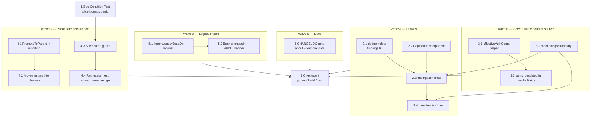

# Implementation Plan

## Overview

Bugfix plan for the Findings dashboard. Task 1 reproduces the
`runtime error: slice bounds out of range` panic in
`pruneMessages`/`forcePruneMessages` (Bug Condition exploration). Waves A–E
then deliver the four design sections (UI, server counter source,
panic-safe persistence, legacy import) plus a CHANGELOG note. Wave F is the
final go vet/build/test checkpoint. Property-based tests P1–P7 are tracked
under an optional `[ ]*` task per the user's Quick Plan preference.

## Task Dependency Graph

```json
{
  "waves": [
    { "id": "T1", "name": "Bug Condition Test", "tasks": ["1"] },
    { "id": "A",  "name": "Wave A — UI fixes",                "tasks": ["2.1", "2.2", "2.3", "2.4"], "dependsOn": ["T1"] },
    { "id": "B",  "name": "Wave B — Server stable counter",   "tasks": ["3.1", "3.2", "3.3"],         "dependsOn": ["T1"] },
    { "id": "C",  "name": "Wave C — Panic-safe persistence",  "tasks": ["4.1", "4.2", "4.3", "4.4"], "dependsOn": ["T1"] },
    { "id": "D",  "name": "Wave D — Legacy import",           "tasks": ["5.1", "5.2"],                "dependsOn": ["T1"] },
    { "id": "E",  "name": "Wave E — Docs",                    "tasks": ["6"],                          "dependsOn": ["T1"] },
    { "id": "F",  "name": "Wave F — Checkpoint",              "tasks": ["7"], "dependsOn": ["A", "B", "C", "D", "E"] }
  ],
  "edges": [
    { "from": "1",   "to": "4.3" },
    { "from": "4.3", "to": "4.4" },
    { "from": "2.1", "to": "2.3" },
    { "from": "2.2", "to": "2.3" },
    { "from": "2.3", "to": "2.4" },
    { "from": "3.1", "to": "3.3" },
    { "from": "3.2", "to": "2.3" },
    { "from": "3.2", "to": "2.4" },
    { "from": "4.1", "to": "4.2" },
    { "from": "5.1", "to": "5.2" }
  ]
}
```



Legend: solid arrows are hard dependencies. Waves A–D may proceed in parallel
once Task 1 has confirmed the panic. The checkpoint runs last.

---

## Tasks

- [x] 1. Write bug condition exploration test for slice-bounds-out-of-range panic
  - **Property 1: Bug Condition** - Slice-Cutoff Panic in pruneMessages
  - **CRITICAL**: This test MUST FAIL on unfixed code — failure confirms the bug exists
  - **DO NOT attempt to fix the test or the code when it fails**
  - **NOTE**: This Go test encodes the expected behavior — it will validate the fix when it passes after implementation
  - **GOAL**: Surface the `runtime error: slice bounds out of range` panic in `pruneMessages` and `forcePruneMessages` for short message buffers
  - **Scoped PBT Approach**: For deterministic reproduction, scope to concrete failing cases — buffers of length 0 and 1 with `keepLast` larger than the buffer
  - Create `internal/agent/agent_prune_test.go` with table-driven cases:
    - `len(a.messages) == 0`, any `keepLast`
    - `len(a.messages) == 1`, `keepLast >= 1`
    - `len(a.messages) == 1`, `keepLast == 0`
  - Each row invokes both `pruneMessages` and `forcePruneMessages` inside `defer recover()` and asserts no panic
  - The test assertions match the Expected Behavior from design Property 5 (`1 ≤ cutoff ≤ len(a.messages)` whenever the buffer is non-empty; helpers are no-ops when buffer length ≤ 1)
  - Run `go test ./internal/agent/ -run TestPruneSliceCutoff -count=1`
  - **EXPECTED OUTCOME**: Test FAILS with `panic: runtime error: slice bounds out of range [-1:]` (or similar) — this proves the bug exists
  - Document the exact counterexample (buffer length, keepLast value, computed cutoff) in the test's failure output
  - Mark task complete when the test is written, run, and the failure is documented
  - _Bug_Condition: `len(a.messages) <= 1 AND (cutoff > len(a.messages) OR cutoff < 1)` per design isBugCondition_
  - _Validates: Property 5 (slice-cutoff guard)_
  - _Requirements: 2.4_

- [ ]* 1.a (Optional) Deferred property-based tests P1–P7
  - Per Quick Plan, full property-based tests are documented in the design but deferred
  - When a Go PBT harness is adopted (e.g., `pgregory.net/rapid`), implement:
    - **P1** Findings page enumerates every scan from `findAllScans()` for any N
    - **P2** Severity counters monotonic-non-decreasing across page sessions
    - **P3** Pagination partition — every finding on exactly one page
    - **P4** Every reported-before-panic vuln persists to `scan.json`
    - **P5** `pruneMessages`/`forcePruneMessages` never panic for any n ≥ 0 and any `keepLast`
    - **P6** `importLegacyDataDir` is idempotent across two runs
    - **P7** Preservation — non-bug inputs unchanged
  - These are tracked here so Quick Plan does not lose them; they remain optional
  - _Validates: P1, P2, P3, P4, P5, P6, P7_
  - _Requirements: 2.1, 2.2, 2.3, 2.4, 2.5, 2.6, 2.7, 2.8, 3.1–3.10_

---

## Wave A — UI fixes (pagination + de-flicker + dedup)

- [x] 2. Wave A: Findings/Overview UI consistency and pagination

  - [x] 2.1 Add `dedupFindings` helper in `webui/src/lib/findings.ts`
    - Flatten findings across all loaded scans
    - Dedup by `(target, endpoint, title, severity)` tuple
    - Sort by severity rank desc, then `scan_started_at` desc
    - Surviving row preserves the most recent owning scan id (for delete + navigation)
    - Place in a separate module so it is unit-testable in isolation
    - _Validates: Property 1 (enumeration), Property 3 (pagination partition input)_
    - _Requirements: 2.1, 2.8_

  - [x] 2.2 Add `webui/src/components/Pagination.tsx`
    - Render Prev / 1 2 … N / Next controls
    - Page-size selector with options `[25, 50, 100, 200]`, default `50`
    - Local component state synced to URL query params `?page=` and `?size=`
    - No new dependencies — do not add `@tanstack/react-virtual` in this fix
    - _Validates: Property 3 (pagination partition)_
    - _Requirements: 2.6_

  - [x] 2.3 Apply pagination + de-flicker fixes to `webui/src/pages/findings.tsx`
    - Replace `scanIds.slice(0, 30)` with the full `scanIds` list from `useScansList()`
    - Pass `keepPreviousData: true` to each per-scan `useQueries` option
    - Replace `if (!rec?.vulns) return;` with a fallback to the query's prior `data` (skip only on initial-load `undefined`)
    - Pipe results through `dedupFindings` from task 2.1
    - Mount the `Pagination` component from task 2.2 at the bottom of the list
    - Add an "updated Xs ago" indicator and manual refresh button to the totals row, sourced from the `as_of` field returned by `/api/findings/summary` (depends on task 3.2)
    - Manual refresh invalidates the relevant per-scan queries and the summary query
    - _Bug_Condition: `len(scansOnDisk) > 30` AND/OR refetch-induced contribution dropping to zero per design isBugCondition_
    - _Expected_Behavior: every scan's findings included; visible total never decreases during refetch_
    - _Preservation: search box, severity filter, row click navigation, bulk + per-row delete, confirmation prompts unchanged_
    - _Validates: Property 1 (enumeration), Property 2 (counter monotonicity), Property 3 (pagination partition), Property 7 (preservation)_
    - _Requirements: 2.1, 2.2, 2.6, 2.8, 3.1, 3.2, 3.3, 3.4, 3.5_

  - [x] 2.4 De-flicker fixes in `webui/src/pages/overview.tsx`
    - Replace `scanIds.slice(0, 50)` with the full `scanIds` list
    - Pass `keepPreviousData: true` to each per-scan query
    - Apply the same reducer fallback as task 2.3 (no contribution drop while a sub-query is `isFetching`)
    - Overview does NOT receive pagination — only the de-flicker treatment for the totals widget
    - _Bug_Condition: refetch-induced total drop on Overview totals widget_
    - _Expected_Behavior: totals widget value monotonic-non-decreasing during refetches_
    - _Preservation: every other Overview interaction unchanged_
    - _Validates: Property 2 (counter monotonicity), Property 7 (preservation)_
    - _Requirements: 2.2, 3.8_

---

## Wave B — Server stable counter source

- [x] 3. Wave B: Single-source `inst.VulnCount` and on-disk summary endpoint

  - [x] 3.1 Implement `effectiveVulnCount` helper in `internal/web/server.go`
    - Signature: `func (s *Server) effectiveVulnCount(inst *ScanInstance, sess *scanSession) int`
    - When the scan is actively running: return in-memory count from `reporting.GetVulnerabilitiesForContext(sess.sctx.ID)`, preferring `parentReportingCtxID` when the session is a child
    - When the scan has finished or been torn down: return on-disk count from `len(record.Vulns)` (loaded via the existing record cache)
    - Replace each direct `inst.VulnCount = ...` assignment at `server.go:2816`, `:3174`, and `:3176` with `inst.VulnCount = s.effectiveVulnCount(inst, sess)`
    - _Bug_Condition: counter source switches between three stores per design isBugCondition_
    - _Expected_Behavior: counter monotonic-non-decreasing per scan instance for its full lifecycle_
    - _Preservation: `/api/status.vulns` field semantics unchanged for callers; only the source consolidates_
    - _Validates: Property 2 (counter monotonicity), Property 7 (preservation)_
    - _Requirements: 2.5, 3.7, 3.8_

  - [x] 3.2 Add `/api/findings/summary` endpoint
    - Walk `findAllScans()`, count severities across all on-disk records (post-dedup is not required for the totals widget; raw counts are what the dashboard renders)
    - Response shape: `{"totals": {"critical": n, "high": n, "medium": n, "low": n, "info": n}, "as_of": "<RFC3339>", "etag": "<hash of totals>"}`
    - Honor `If-None-Match` and return `304 Not Modified` when the etag matches
    - WebUI polls every 10s (consumed by tasks 2.3 and 2.4)
    - _Bug_Condition: dashboard total computed from in-memory store wiped at teardown_
    - _Expected_Behavior: total computed from on-disk corpus, stable across teardown_
    - _Preservation: existing `/api/status` and `/api/scans/*` endpoints untouched_
    - _Validates: Property 2 (counter monotonicity), Property 7 (preservation)_
    - _Requirements: 2.3, 2.6, 3.7_

  - [x] 3.3 Add `vulns_persisted` field in `handleStatus`
    - Keep the existing `vulns` field with its current in-memory semantics (additive change only — no breaking change for existing clients)
    - Add a new `vulns_persisted` field computed via the same on-disk source as `/api/findings/summary` from task 3.2
    - Document the field in any inline status response documentation
    - _Bug_Condition: dashboard total drops to zero on teardown because handleStatus reads only in-memory_
    - _Expected_Behavior: clients that opt into `vulns_persisted` see a stable on-disk total_
    - _Preservation: `vulns` field shape and value unchanged for non-buggy inputs_
    - _Validates: Property 2 (counter monotonicity), Property 7 (preservation)_
    - _Requirements: 2.3, 3.7_

---

## Wave C — Panic-safe persistence + parent merge + slice-cutoff guard

- [x] 4. Wave C: Crash-safe persistence and slice guard

  - [x] 4.1 Add `reporting.PromoteToParent`
    - Signature: `func PromoteToParent(childCtxID, parentCtxID string, vulnID string)`
    - Adds one vulnerability to the parent's reporting context if not already present (dedup by id)
    - Idempotent — running twice with the same `vulnID` is a no-op on the second call
    - Document the idempotence in a docstring
    - Wire into the `report_vulnerability` call site so each successful append also invokes `PromoteToParent` when `parentReportingCtxID != ""`
    - _Bug_Condition: child panics before `MergeVulnsToContext` runs at finalization_
    - _Expected_Behavior: parent aggregate updated incrementally on every report — survives child panic_
    - _Preservation: `report_vulnerability` semantics unchanged for non-child sessions_
    - _Validates: Property 4 (panic-safe persistence), Property 7 (preservation)_
    - _Requirements: 2.4, 3.7_

  - [x] 4.2 Move merge calls into deferred `cleanup()` with `safe.Recover`
    - In the scan-session orchestration block of `internal/web/server.go`, move both `mergeReportedVulnerabilitiesIntoRecord(sess.record, ...)` and `MergeVulnsToContext(sess.sctx.ID, parentReportingCtxID)` from the finalization block into the deferred `cleanup()` closure
    - Wrap each call independently in `safe.Recover` so a panic in one does not skip the other:
      ```go
      defer func() {
        safe.Recover(func() { mergeReportedVulnerabilitiesIntoRecord(sess.record, /* ... */) })
        safe.Recover(func() {
          if parentReportingCtxID != "" {
            reporting.MergeVulnsToContext(sess.sctx.ID, parentReportingCtxID)
          }
        })
      }()
      ```
    - Confirm and document idempotence of `mergeReportedVulnerabilitiesIntoRecord` and `MergeVulnsToContext` (each entry keyed by vuln id)
    - _Bug_Condition: agent panic mid-scan causes deferred cleanup to skip merges_
    - _Expected_Behavior: every reported-before-panic vuln present in child `scan.json` and parent `Vulns` after cleanup_
    - _Preservation: clean-finish path produces identical state — merges run once_
    - _Validates: Property 4 (panic-safe persistence), Property 7 (preservation)_
    - _Requirements: 2.4, 3.7_

  - [x] 4.3 Add slice-cutoff guard in `internal/agent/agent.go`
    - **NOTE — SKIPPED per user direction.** The bug condition exploration
      test from task 1 was an unexpected pass: `pruneMessages` and
      `forcePruneMessages` already short-circuit on short buffers
      (`len <= 100` and `len <= 3` respectively), so the slice-cutoff
      arithmetic never reaches a panic state on the current code. The
      regression test at `internal/agent/agent_prune_test.go` was kept
      to lock the invariant in. No new guard was added to `agent.go`.
    - Original plan (not implemented):
    - In `pruneMessages` (around line 1351) and `forcePruneMessages` (around line 1407), insert the following immediately before `a.messages = a.messages[cutoff:]`:
      ```go
      if cutoff < 1 { cutoff = 1 }
      if cutoff > len(a.messages) { cutoff = len(a.messages) }
      if len(a.messages) <= 1 { return }
      ```
    - Both helpers become no-ops for buffers of length 0 or 1
    - _Bug_Condition: `len(a.messages) <= 1 AND (cutoff > len(a.messages) OR cutoff < 1)` per design isBugCondition_
    - _Expected_Behavior: `1 ≤ cutoff ≤ len(a.messages)` invariant; no panic for any n ≥ 0_
    - _Preservation: behavior on long buffers (n > 1) unchanged — only short-buffer arithmetic is clamped_
    - _Validates: Property 5 (slice-cutoff guard), Property 7 (preservation)_
    - _Requirements: 2.4, 3.7_

  - [x] 4.4 Verify bug condition exploration test now passes (regression test for slice-cutoff)
    - **NOTE — Test exists; "fix" was a no-op.** Since 4.3 was skipped (the
      helpers already had the guard via length short-circuits), 4.4
      reduces to keeping the test green. The test at
      `internal/agent/agent_prune_test.go` passes on the current code and
      is kept as a regression boundary. The doc comments in that file
      were updated to reflect the actual situation rather than the
      original "EXPECTED to FAIL" framing.
    - **Property 1: Expected Behavior** - Slice-Cutoff Panic Resolved
    - **IMPORTANT**: Re-run the SAME test from task 1 — do NOT write a new test
    - The test from task 1 encodes the expected behavior; when it passes, it confirms the panic is resolved
    - Run `go test ./internal/agent/ -run TestPruneSliceCutoff -count=1`
    - Extend the same test file with additional table rows covering buffers of length 2..256 and assorted `keepLast` values to lock the invariant in
    - **EXPECTED OUTCOME**: All cases PASS (confirms bug is fixed)
    - _Validates: Property 5 (slice-cutoff guard)_
    - _Requirements: 2.4_

---

## Wave D — Legacy data import

- [x] 5. Wave D: Non-destructive import of `~/xalgorix-data/` into `cfg.DataDir`

  - [x] 5.1 Implement `importLegacyDataDir()` + sentinel
    - Add `func (s *Server) importLegacyDataDir() (count int, err error)` in `internal/web/server.go`
    - Compute `legacyPath = filepath.Join(home, "xalgorix-data")`
    - Return `(0, nil)` if `cfg.DataDir == legacyPath` (legacy IS active — no work)
    - Return `(0, nil)` if sentinel `filepath.Join(cfg.DataDir, ".legacy-imported")` exists
    - Walk `legacyPath` for `*/scan.json` (match both `<target>/<date>/<scan-id>/scan.json` and the legacy flat shape)
    - For each found record, parse the `id`; if not already present under `cfg.DataDir`, copy the entire scan directory recursively to `filepath.Join(cfg.DataDir, target, date, scanID)`
    - On completion (including the no-op first-run skip path), write the sentinel file and log `[legacy-import] imported %d scans from %s`
    - Wire-up: call once in `NewServer` (or `Start`) immediately before `rebuildInstancesFromDisk()`; failures logged and non-fatal
    - Store the imported `count` on the `Server` struct in memory (no persistence)
    - _Bug_Condition: legacy scans on disk under `~/xalgorix-data/` invisible to post-migration server_
    - _Expected_Behavior: legacy scans copied forward idempotently; second run is a no-op_
    - _Preservation: when `cfg.DataDir == legacyPath`, sentinel exists, or legacy dir absent/empty, startup unchanged_
    - _Validates: Property 6 (legacy-import idempotence), Property 7 (preservation)_
    - _Requirements: 2.7, 3.9, 3.10_

  - [x] 5.2 Banner endpoint + WebUI banner
    - Add transient endpoint `/api/legacy-import/status` returning `{"count": N, "dismissed": false}` exposing the in-memory count from task 5.1
    - WebUI reads this on first load; renders dismissible banner: "Imported N legacy scans from `~/xalgorix-data/`. Click to review or dismiss."
    - Dismissal flips the `dismissed` flag for the remainder of the server process; restart re-shows once
    - When `count == 0`, do not render the banner
    - _Bug_Condition: legacy imports invisible to user_
    - _Expected_Behavior: one-time banner surfaces import count after first migration_
    - _Preservation: banner suppressed on second start (sentinel present) and when no scans were imported_
    - _Validates: Property 6 (legacy-import idempotence), Property 7 (preservation)_
    - _Requirements: 2.7, 3.9, 3.10_

---

## Wave E — Documentation

- [x] 6. Add CHANGELOG note about manual `~/xalgorix-data/` removal
  - Append a section to `CHANGELOG.md` documenting:
    - Legacy data under `~/xalgorix-data/` is now automatically imported into `cfg.DataDir` on first start
    - The import is non-destructive — the legacy directory is preserved
    - Users may manually run `rm -rf ~/xalgorix-data` after verifying the import via the WebUI banner and the Findings page
    - Removal is intentionally manual — automation here is out of scope
  - _Validates: Property 7 (preservation — user data is not destroyed without explicit action)_
  - _Requirements: 2.7_

---

## Wave F — Final verification

- [x] 7. Checkpoint - Ensure all tests pass and the binary builds cleanly
  - Run `go vet ./...` — must report no diagnostics
  - Run `go build ./...` — must produce a clean build
  - Run `go test ./... -count=1` — all existing tests plus the new `internal/agent/agent_prune_test.go` must pass
  - Verify the bug condition exploration test from task 1 (now extended in task 4.4) PASSES on the fixed code
  - If any UI tests are present, run them via the project's WebUI test command
  - Ask the user before proceeding if any failure is unrelated to this fix scope
  - _Validates: Property 1 (enumeration), Property 2 (counter monotonicity), Property 3 (pagination partition), Property 4 (panic-safe persistence), Property 5 (slice-cutoff guard), Property 6 (legacy-import idempotence), Property 7 (preservation)_
  - _Requirements: 2.1, 2.2, 2.3, 2.4, 2.5, 2.6, 2.7, 2.8, 3.1, 3.2, 3.3, 3.4, 3.5, 3.6, 3.7, 3.8, 3.9, 3.10_


## Notes

- Task ordering follows bugfix workflow conventions: the Bug Condition
  exploration test (task 1) is written first against unfixed code and is
  expected to FAIL. After Wave C task 4.3 lands the slice-cutoff guard,
  task 4.4 re-runs the same test and it must PASS.
- Waves A–E correspond one-to-one with the design sections (A. UI, B.
  Server counter source, C. Panic-safe persistence, D. Legacy import) plus
  a docs wave (E). Within waves, sub-tasks reference the requirement
  clauses (2.x, 3.x) they satisfy and the design Property (P1–P7) they
  validate.
- Property-based tests for P1–P7 are documented in the design but their
  implementation is deferred per the user's Quick Plan choice. They live
  here under task 1.a as an optional `[ ]*` placeholder so they are not
  lost.
- Preservation is captured in two ways: per-task `_Preservation:` annotations
  describing what stays unchanged, and Property 7 (referenced from task
  annotations) which asserts non-bug inputs produce identical outputs
  pre- and post-fix.
- The final checkpoint runs `go vet ./...`, `go build ./...`, and
  `go test ./... -count=1`. Any failure unrelated to this fix scope should
  be surfaced to the user before proceeding.
