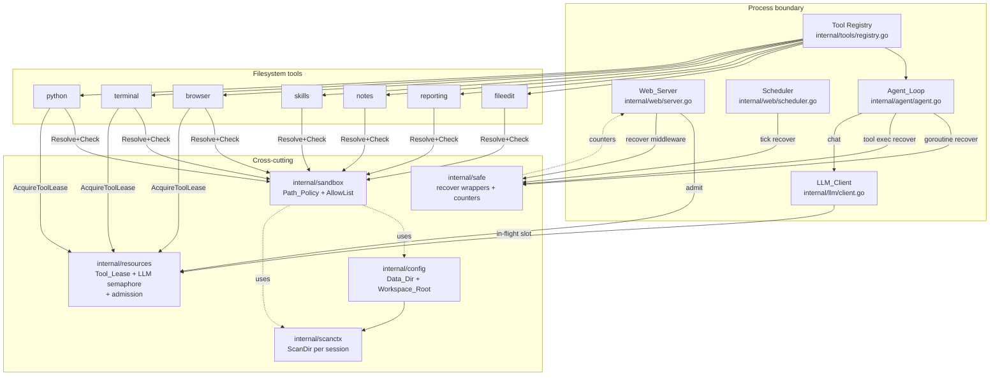
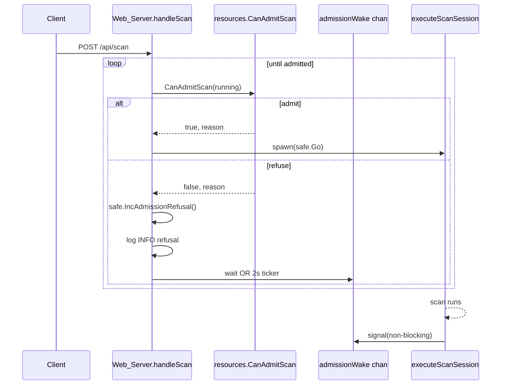
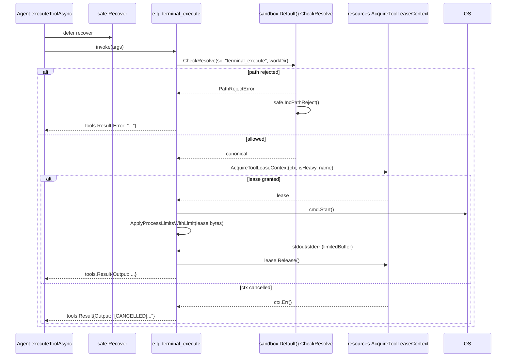
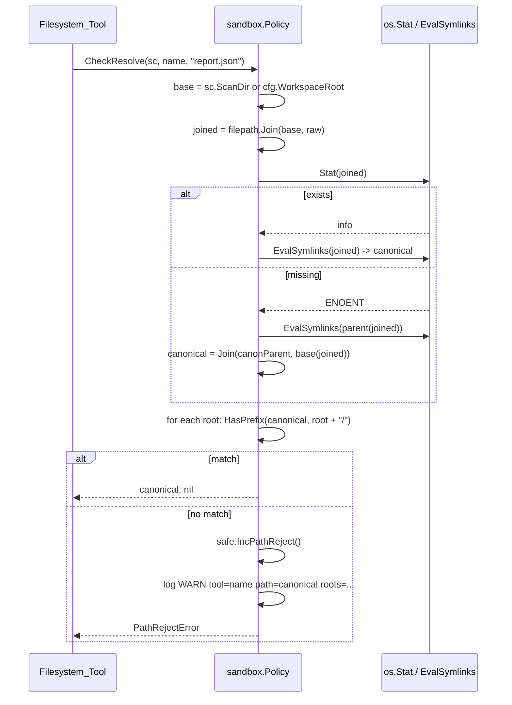
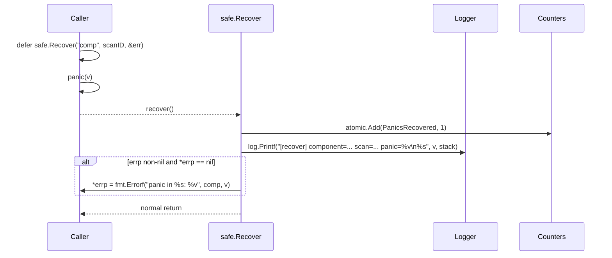

# Design Document

## Overview

This design satisfies Requirements 1–9 by introducing four cross-cutting subsystems and threading them through every existing tool path:

1. **`internal/sandbox`** — a new package owning the **Path_Policy** boundary check, Allow_List composition, structured rejection error, and the WARN-level reject log. Every Filesystem_Tool calls into it.
2. **Crash-resilience scaffolding** — a small `internal/safe` helper plus `defer recover()` wrappers placed at every panic boundary identified in R1: tool execution, agent goroutines, HTTP middleware, scheduler ticks, LLM client. Recovery feeds a single counter store + structured logger.
3. **Resource bounds** — extends `internal/resources` with an LLM in-flight semaphore, makes `AcquireToolLeaseContext` mandatory for terminal/python/browser, and threads `ApplyProcessLimitsWithLimit` into every tracked subprocess.
4. **Workspace isolation** — adds `Data_Dir` to `internal/config`, replaces `cfg.Workspace = $CWD` with `cfg.Workspace = Data_Dir`, fixes the `preparePythonWorkspace` / `prepareCommandWorkspace` leak, and emits the Migration_Warning when a legacy layout is detected.

The design preserves the existing scan-context registry (`internal/scanctx`) and the `Tool_Lease` API in `internal/resources`. It does not introduce a new IPC layer, sandboxing namespace, or dependency. All mechanisms are in-process and synchronous, which keeps the failure model trivial: a panic in a recovered region produces a log line and a typed error; nothing else.

## Architecture



## Components and Interfaces

### 1. `internal/config` — Data_Dir and Workspace_Root

**New struct fields (added to `Config`):**

```go
type Config struct {
    // ... existing fields ...

    // Data_Dir is the persistent per-installation root for all generated
    // artefacts: scan output, notes, schedules, browser cache, reports.
    // Default: ~/.xalgorix/data/. Override via XALGORIX_DATA_DIR.
    DataDir string

    // WorkspaceRoot is the resolution root used by Filesystem_Tools when no
    // ScanContext.ScanDir is in effect. WorkspaceRoot == DataDir.
    WorkspaceRoot string

    // legacyCWD captures os.Getwd() at config load time. Used only by the
    // migration warning. Not exported; not part of the runtime resolution path.
    legacyCWD string
}
```

`Workspace` (the legacy field) stays for backward compatibility but is **assigned `DataDir`** instead of `$CWD`. Existing call sites that read `cfg.Workspace` therefore become correct without modification. `WorkspacePath()` likewise resolves against `DataDir`.

**Loading logic (replaces the current `cwd`/`workspace` block in `load()`):**

```go
home, _ := os.UserHomeDir()
xalgorixHome := filepath.Join(home, ".xalgorix")

dataDir, dataDirErr := resolveDataDir(home)
if dataDirErr != nil {
    // Fail fast — config.Get() callers already log.Fatalf on Validate()
    // errors. We surface this through the Validate path so existing
    // wiring keeps working.
    log.Printf("[config] FATAL Data_Dir resolution failed: %v", dataDirErr)
}

cwd, _ := os.Getwd()

cfg := &Config{
    // ... existing assignments ...
    DataDir:       dataDir,
    WorkspaceRoot: dataDir,
    Workspace:     dataDir,        // legacy field, now Data_Dir
    HomeDir:       xalgorixHome,
    legacyCWD:     cwd,
}

// Idempotent: only emits if both detection and absence of override hold.
maybeEmitMigrationWarning(cwd, dataDir)
```

**`resolveDataDir`:**

```go
func resolveDataDir(home string) (string, error) {
    raw := os.Getenv("XALGORIX_DATA_DIR")
    if raw == "" {
        raw = filepath.Join(home, ".xalgorix", "data")
    }
    abs, err := filepath.Abs(raw)
    if err != nil {
        return "", fmt.Errorf("data dir %q: %w", raw, err)
    }
    abs = filepath.Clean(abs)
    if err := os.MkdirAll(abs, 0o700); err != nil {
        return "", fmt.Errorf("create data dir %q: %w", abs, err)
    }
    // Tighten if it exists with looser perms (parallels env-file handling).
    _ = os.Chmod(abs, 0o700)
    return abs, nil
}
```

**Validation:** `Validate()` adds `if c.DataDir == ""` guard returning a startup error. The Web_Server's `initDataDir()` becomes a thin wrapper around `cfg.DataDir`.

**Migration_Warning** (R7):

```go
func maybeEmitMigrationWarning(cwd, dataDir string) {
    if os.Getenv("XALGORIX_DATA_DIR") != "" {
        return // R7.4: explicit override suppresses
    }
    if cwd == "" || filepath.Clean(cwd) == filepath.Clean(dataDir) {
        return
    }
    legacy := []string{
        "notes.json",
        "_schedules",
        "vulnerabilities.json",
    }
    found := ""
    for _, name := range legacy {
        if _, err := os.Stat(filepath.Join(cwd, name)); err == nil {
            found = name
            break
        }
    }
    if found == "" {
        // Glob date-pattern dirs (YYYY-MM-DD/scan-*)
        matches, _ := filepath.Glob(filepath.Join(cwd, "20??-??-??", "scan-*"))
        if len(matches) > 0 {
            found = "date-stamped scan output"
        }
    }
    if found == "" {
        return
    }
    log.Printf("[MIGRATION] Detected legacy workspace layout under %s "+
        "(matched %q). The default data directory has changed in this "+
        "release to %s. To keep writing to the legacy location, run with "+
        "XALGORIX_DATA_DIR=%s", cwd, found, dataDir, cwd)
}
```

The warning is gated behind a `sync.Once` indirectly — `config.Get()` already memoizes via `configOnce`, so a repeated `Get()` cannot re-emit (R7.3).

### 2. `internal/sandbox` — Path_Policy

A new small package. The recommended location is its own folder so the dependency graph stays clean: `sandbox` imports `config` and `scanctx`, and is imported by every Filesystem_Tool. Extending `scanctx` was considered and rejected — `scanctx` is per-session state, while Path_Policy is process-global.

**Public API:**

```go
package sandbox

// Policy is the immutable Allow_List boundary check used by every
// Filesystem_Tool. Construct once via Default() (lazy singleton); pass
// explicitly in tests via New().
type Policy struct {
    roots []string // canonicalized, sorted by length descending
}

// New constructs a Policy with the supplied allow-list roots.
// Each root is canonicalized via filepath.Abs + filepath.Clean.
// Empty or duplicate entries are dropped.
func New(roots ...string) *Policy

// Default returns the process-global Policy assembled from:
//   - cfg.DataDir             (active workspace)
//   - cfg.HomeDir (~/.xalgorix)
//   - "/tmp"
// Memoized via sync.Once. The first call must follow config.Get().
func Default() *Policy

// Resolve turns (sc, raw) into an absolute, canonical path WITHOUT
// performing the allow-list check. Relative paths resolve under
// sc.ScanDir if non-nil and non-empty, else under cfg.WorkspaceRoot.
//
// Canonicalization rule (R5.2):
//   - if the path exists: filepath.EvalSymlinks
//   - if it does not:    filepath.Clean(filepath.Abs(...))
//   - the parent is also EvalSymlink'd so a symlinked directory containing
//     a not-yet-created leaf is honored.
func (p *Policy) Resolve(sc *scanctx.ScanContext, raw string) (string, error)

// Check applies the allow-list check to a canonical path and returns a
// PathRejectError on violation. Idempotent and side-effect-free.
func (p *Policy) Check(canonical string) error

// CheckResolve is the common one-shot path: Resolve + Check + log on reject.
// Tools normally call this. The toolName + scID are baked into the structured
// log line on reject (R5.6, R9.1).
func (p *Policy) CheckResolve(sc *scanctx.ScanContext, toolName, raw string) (string, error)

// Roots returns a defensive copy of the allow-list roots, used by error
// messages, tests, and the health endpoint.
func (p *Policy) Roots() []string
```

**Error shape (R5.3, R8.3):**

```go
type PathRejectError struct {
    Tool      string   // e.g. "python_action", "fileedit.replace"
    Path      string   // canonical form of the rejected path
    Roots     []string // allow-list roots at time of decision
    ScanCtxID string   // sc.ID, may be ""
}

func (e *PathRejectError) Error() string {
    return fmt.Sprintf("path-policy reject: tool=%s scan=%s path=%s allowed=%v",
        e.Tool, e.ScanCtxID, e.Path, e.Roots)
}

// Is enables errors.Is(err, sandbox.ErrPathReject) for callers that want a
// sentinel without unwrapping.
var ErrPathReject = errors.New("path-policy reject")
func (e *PathRejectError) Is(target error) bool { return target == ErrPathReject }
```

**Containment check (`Check`):**

```go
func (p *Policy) Check(canonical string) error {
    abs, err := filepath.Abs(canonical)
    if err != nil {
        return fmt.Errorf("path policy: abs(%s): %w", canonical, err)
    }
    abs = filepath.Clean(abs)
    for _, root := range p.roots {
        if abs == root || strings.HasPrefix(abs, root+string(filepath.Separator)) {
            return nil
        }
    }
    return &PathRejectError{Path: abs, Roots: append([]string(nil), p.roots...)}
}
```

This handles R5.4 (relative, `..`, symlinks) because `Resolve` always canonicalizes before `Check`. Symlink-trap protection (R5.3 + property P5.3): `EvalSymlinks` is applied to **the parent** when the leaf does not exist, and `EvalSymlinks` chases the chain when it does — so a symlink inside Data_Dir pointing to `/etc` resolves to `/etc` and is rejected.

**Counter integration:** `CheckResolve` increments `safe.PathRejectionCounter()` on reject so the health endpoint can surface it (R9.5).

### 3. `internal/safe` — panic recovery + counters

A small new package collocated with `internal/resources`. Owns:

```go
package safe

// Counters exposed via Snapshot() for the health endpoint.
type Counters struct {
    PanicsRecovered    uint64
    PathRejections     uint64
    WatchdogKills      uint64
    AdmissionRefusals  uint64
}

// Snapshot returns an atomic read of all counters.
func Snapshot() Counters

// IncPanic / IncPathReject / IncWatchdogKill / IncAdmissionRefusal
// are atomic counter mutators called from each producer site.
func IncPanic()
func IncPathReject()
func IncWatchdogKill()
func IncAdmissionRefusal()

// Recover is the canonical defer wrapper. It captures any panic, logs a
// structured entry with component, optional scan_id, panic value, and a
// stack trace, increments PanicsRecovered, and returns. Use in defer:
//
//   defer safe.Recover("agent.tool_exec", scanID)
//
// If errp is non-nil and *errp == nil at the time of the panic, the
// recovered panic is converted to a typed error and stored there so the
// caller can surface it as a tool result.
func Recover(component, scanID string, errp ...*error)

// Go runs fn in a goroutine guarded by Recover. The goroutine name is
// included in the log line. This replaces every bare `go fn()` in
// agent.go, server.go, scheduler.go, and llm/client.go.
func Go(component string, scanID string, fn func())

// HTTPMiddleware wraps an http.Handler in a panic recovery boundary.
// On panic it writes 503 with no body (so a panic cannot leak detail
// to a remote caller) and emits the structured log + counter increment.
func HTTPMiddleware(next http.Handler) http.Handler
```

**Why a separate package and not `internal/resources`:** counters and recovery need to be importable from `config`, `sandbox`, `agent`, `web`, and `tools/*` without pulling in `runtime/debug`-driven RAM monitoring. Keeping `safe` minimal avoids a cyclic-import risk and gives tests a pure target.

**Structured log shape (R1.6):**

```
[recover] component=agent.tool_exec scan=inst-7f3a panic="runtime error: invalid memory address" stack=
goroutine 412 [running]:
runtime/debug.Stack()
        ...
github.com/xalgord/xalgorix/v4/internal/safe.Recover(...)
        ...
```

Single `log.Printf` call so the entry is line-buffered and trivially greppable, satisfying P1.3 (one log per panic) and P9.2 (event-to-log correspondence).

### 4. `internal/resources` — LLM semaphore + lease enforcement

**LLM in-flight cap (R3.3, R3.4):** add a process-global weighted semaphore.

```go
// In internal/resources/llm.go (new file)

var (
    llmInFlight  *semaphore.Weighted
    llmOnce      sync.Once
    llmCap       int64
)

func initLLMSemaphore() {
    cap, _ := strconv.Atoi(os.Getenv("XALGORIX_LLM_MAX_INFLIGHT"))
    if cap <= 0 {
        eff, _ := EffectiveMaxInstances()
        if eff < 1 {
            eff = 1
        }
        cap = 4 * eff
    }
    if cap < 1 {
        cap = 1
    }
    llmCap = int64(cap)
    llmInFlight = semaphore.NewWeighted(llmCap)
}

// AcquireLLMSlot blocks until an in-flight LLM slot is available or ctx
// is cancelled. Returns (release, err). release MUST be called in a defer
// once the LLM call returns. Honors ctx cancellation (R3.4, P3.4).
func AcquireLLMSlot(ctx context.Context) (func(), error) {
    llmOnce.Do(initLLMSemaphore)
    if err := llmInFlight.Acquire(ctx, 1); err != nil {
        return func() {}, err
    }
    return func() { llmInFlight.Release(1) }, nil
}

// LLMInFlightCap exposes the configured cap for diagnostics.
func LLMInFlightCap() int { return int(atomic.LoadInt64(&llmCap)) }
```

Uses `golang.org/x/sync/semaphore`, already idiomatic in the Go stdlib ecosystem and zero-overhead when uncontended.

**Where it plugs in (`internal/llm/client.go`):**

```go
// In doChat, before issuing the HTTP request:
release, err := resources.AcquireLLMSlot(ctx)
if err != nil {
    return "", fmt.Errorf("llm slot: %w", err)
}
defer release()
```

**Universal `AcquireToolLeaseContext` (R4.1–R4.3):**
- `internal/tools/python/python.go` — already calls `AcquireToolLeaseContext`. Keep.
- `internal/tools/terminal/terminal.go` — already wraps heavy commands; extend so every tracked subprocess goes through it (light tools too, via `isHeavy=false`). Consolidate the call so there is exactly one acquire/release pair per `runShellInternal`.
- `internal/tools/browser/*.go` — currently launches without a lease. Add `AcquireToolLeaseContext(ctx, false /* isHeavy */, "browser_action")` before the first browser-context creation in a scan, and release on `BrowserState.Close()`.

**`ApplyProcessLimitsWithLimit` everywhere:** every `cmd.Start()` site that tracks the process must call `terminal.ApplyProcessLimitsWithLimit(cmd, true, lease.MemoryLimitBytes())` immediately after `Start()`. This is already done in python.go; mirror it in terminal.go's `runShellInternal`.

### 5. Crash recovery scaffolding

| Boundary                                  | File                                      | Wrapper                                 |
| ----------------------------------------- | ----------------------------------------- | --------------------------------------- |
| Tool execution                            | `internal/agent/agent.go::executeToolAsync` | `defer safe.Recover("agent.tool_exec", a.scanCtx.ID, &returnErr)` |
| Agent goroutines (heartbeat, watchdog, stream) | `internal/agent/agent.go`           | replace `go ...` with `safe.Go(...)`    |
| HTTP handlers                             | `internal/web/server.go::Start`           | wrap mux with `safe.HTTPMiddleware`     |
| Scheduler tick                            | `internal/web/scheduler.go::checkAndRunSchedules` | `defer safe.Recover("scheduler.tick", "")` and per-schedule `safe.Recover("scheduler."+sch.ID, "")` inside the loop |
| LLM client                                | `internal/llm/client.go::doChat`          | `defer safe.Recover("llm.doChat", scanID, &err)` |
| LLM client streaming                      | `internal/llm/client.go::ChatStream`      | wrap the spawned goroutine in `safe.Go` |
| ScanContext close                         | `internal/scanctx/context.go::Close`      | `defer safe.Recover("scanctx.close", sc.ID)` |

The existing `logRecover` in `web/server.go` is replaced with calls to `safe.Recover` (preserving the same defer points).

### 6. Hard timeouts and watchdog (R2.1, R2.2)

The current code already has `computeTimeout` per command in `terminal.go`. The design formalizes the family-level ceilings so the agent enforces them even when a tool ignores its own timeout argument:

```go
// internal/agent/agent.go (new)
var toolHardTimeout = map[string]time.Duration{
    "terminal_execute": 65 * time.Minute,
    "browser_action":   10 * time.Minute,
    // every other tool inherits the default below
}
const defaultToolHardTimeout = 15 * time.Minute

func (a *Agent) hardTimeoutFor(tool string) time.Duration {
    if t, ok := toolHardTimeout[tool]; ok {
        return t
    }
    return defaultToolHardTimeout
}
```

`executeToolAsync` wraps the tool call in a `context.WithTimeout(parent, a.hardTimeoutFor(tool) + 30*time.Second)` outer guard so even a misbehaving tool that swallows context cancellation still returns within the deadline + grace (P2.1).

The existing `startWatchdog` is extended to:
1. Increment `safe.IncWatchdogKill()` whenever it kills a process.
2. Emit a structured WARN log with `command`, `duration`, `scan_id` (R9.3).

### 7. Bounded stdout/stderr (R2.4, R2.5)

`limitedBuffer` already exists in `internal/tools/python/python.go`. Move it to `internal/tools/iolimit` (small new file) so terminal can share it. Both tools then construct buffers with `1<<20` for stdout and `1<<19` for stderr, and the `Truncated()` flag fires at exactly the limit byte (P2.2).

### 8. Web admission + slot accounting (R3.1, R3.2, R3.6)

`s.runMultiScan` already calls `resources.CanAdmitScan`. The design formalizes:

- On refusal, `safe.IncAdmissionRefusal()` and a structured INFO log with `level=<level> reason=<reason> ceiling=<n>` (R9.2).
- The polling loop already retries every 2s. We replace the busy poll with a buffered channel so an instance terminating wakes exactly one waiter (P3.3): `s.admissionWake chan struct{}` with `len=1`, signalled in `executeScanSession`'s defer cleanup.

```go
// On instance terminate:
defer func() {
    select { case s.admissionWake <- struct{}{}: default: }
}()
```

### 9. Health endpoint counters (R9.5)

`handleStatus` already returns a JSON map. Extend it:

```go
counters := safe.Snapshot()
json.NewEncoder(w).Encode(map[string]any{
    "running":              s.running.Load() || runningCount > 0,
    "scan_id":              scanID,
    "instance_id":          runningInstanceID,
    "current_phase":        currentPhase,
    "vulns":                totalVulns,
    "running_instances":    runningCount,
    "panics_recovered":     counters.PanicsRecovered,
    "path_rejections":      counters.PathRejections,
    "watchdog_kills":       counters.WatchdogKills,
    "admission_refusals":   counters.AdmissionRefusals,
    "llm_inflight_cap":     resources.LLMInFlightCap(),
    "data_dir":             cfg.DataDir,
    "allow_list":           sandbox.Default().Roots(),
})
```

Counters are `uint64` and only ever incremented via `atomic.AddUint64`, satisfying P9.1 (monotonicity).

## Sequence Diagrams

### Scan admission (R3.1, R3.2, R3.6)



### Tool invocation under leases (R4.1–R4.5)



### Path_Policy check (R5.x)



### Panic recovery (R1.x, R9.4)



## Data Models

### `sandbox.Policy`

| Field    | Type       | Notes                                                                  |
| -------- | ---------- | ---------------------------------------------------------------------- |
| `roots`  | `[]string` | Canonical absolute prefixes, deduped, sorted longest-first for stable matching. Immutable after construction. |

### `safe.Counters`

| Field               | Type     | Source                                              |
| ------------------- | -------- | --------------------------------------------------- |
| `PanicsRecovered`   | `uint64` | every `safe.Recover` and `safe.HTTPMiddleware` hit  |
| `PathRejections`    | `uint64` | every `Policy.CheckResolve` reject                  |
| `WatchdogKills`     | `uint64` | `agent.startWatchdog` kill branch                   |
| `AdmissionRefusals` | `uint64` | `Web_Server.runMultiScan` admission refusal         |

All `uint64` to make wrap-around effectively impossible over a process lifetime, and to allow lock-free atomic reads.

### `config.Config` (additions)

| Field           | Type     | Source                                  |
| --------------- | -------- | --------------------------------------- |
| `DataDir`       | `string` | `XALGORIX_DATA_DIR` or `~/.xalgorix/data` |
| `WorkspaceRoot` | `string` | mirrors `DataDir`                       |
| `legacyCWD`     | `string` | unexported, captured at load time, used only by migration warning |

`Workspace` (existing) is reassigned to `DataDir` so legacy callers stay correct.

## Error Handling

| Failure                                | Surfaced as                                                       | Counter                  | Log level |
| -------------------------------------- | ----------------------------------------------------------------- | ------------------------ | --------- |
| Path outside Allow_List                | `*sandbox.PathRejectError` returned to tool, tool returns `tools.Result{Error: ...}` | `PathRejections`         | WARN      |
| Tool panic                             | `tools.Result{Error: "panic in <tool>: <v>"}`, scan continues     | `PanicsRecovered`        | ERROR     |
| Goroutine panic                        | logged only; goroutine exits; spawning component decides on retry  | `PanicsRecovered`        | ERROR     |
| HTTP handler panic                     | HTTP 503 to client, no body                                        | `PanicsRecovered`        | ERROR     |
| Scheduler tick panic                   | tick exits cleanly; next tick runs normally                        | `PanicsRecovered`        | ERROR     |
| LLM call panic / unrecoverable transport | typed error returned; scan terminates with error event           | `PanicsRecovered`        | ERROR     |
| Tool hard-timeout exceeded             | `tools.Result{Error: "[TIMEOUT exceeded <X>s]"}` after subprocess kill | -                        | WARN      |
| Watchdog kill (>30 min)                | error event with command + duration                                | `WatchdogKills`          | WARN      |
| Admission refusal                      | scan stays `pending`, INFO log with reason                         | `AdmissionRefusals`      | INFO      |
| Lease ctx cancel                       | `tools.Result{Output: "[CANCELLED] ..."}`, no subprocess started   | -                        | INFO      |
| Data_Dir resolve/create failure        | startup `error` from `Validate()` → process exits                  | -                        | FATAL     |

The error model is uniform: every Filesystem_Tool returning a `tools.Result{Error: ...}` carries the canonical error message produced by the underlying subsystem, and `errors.Is(err, sandbox.ErrPathReject)` is the sentinel test in any caller that wants to special-case path rejects.

## Migration Story

This release intentionally breaks the `Workspace = $CWD` contract. The migration plan has three pieces:

1. **Default change announcement.** First-run startup with `XALGORIX_DATA_DIR` unset and a legacy layout in `$CWD` emits the **Migration_Warning** to stderr at WARN level (R7.2). The warning states:
   - the detected legacy path,
   - the active Data_Dir,
   - that the new default has changed,
   - and the exact one-liner to retain old behavior:
     `XALGORIX_DATA_DIR=$(pwd)`.

2. **No automatic data movement.** The Config_Loader does not read, copy, or modify any legacy file (R7.5, P7.2). Operators decide whether to keep the legacy directory (by setting the env var) or to move artefacts manually. This is the safest possible behavior — we never destroy a user's existing scan history during an upgrade.

3. **Idempotent detection.** `config.Get()` is gated by `sync.Once`, so the warning fires at most once per process startup (R7.3, P7.1). With `XALGORIX_DATA_DIR` set, the warning is suppressed unconditionally regardless of `$CWD` content (R7.4) so power users running deliberately from the legacy directory do not see noise.

4. **Documented opt-out.** README and `docs/` get a short "Upgrading from previous versions" section that points at the warning and the env-var override. Existing dashboards continue to read `cfg.Workspace`, which now equals `DataDir`, so internal API contracts are preserved.

5. **Backward-compatible field.** `Config.Workspace` and `WorkspacePath` keep their signatures; only their values change. No call site needs to be touched solely for the migration.

## Testing Strategy

The strategy combines focused unit tests (existing layout) with property-based tests (new) for the universal behaviors identified in the prework analysis.

**Property test runner:** [`pgregory.net/rapid`](https://pkg.go.dev/pgregory.net/rapid) — already idiomatic in modern Go projects, supports custom generators, integrates with `*testing.T`, and shrinks counterexamples cleanly. Each `rapid.Check` runs **at least 100 iterations** per property as required by the workflow.

**Test layout:**
- `internal/sandbox/policy_test.go` — Path_Policy properties.
- `internal/safe/recover_test.go` — recovery properties.
- `internal/resources/llm_test.go` — LLM in-flight semaphore properties (extend existing `resources_test.go`).
- `internal/agent/panic_test.go` — agent-level containment property using a stub registry.
- `internal/web/admission_test.go` — admission decision property.
- `internal/config/datadir_test.go` — Data_Dir resolution + Migration_Warning property.
- `internal/tools/python/python_isolation_test.go` and `internal/tools/terminal/terminal_isolation_test.go` — workspace-leak properties.

**Test tagging:** every property test is tagged in its top comment with `Feature: xalgorix-stability-and-workspace-isolation, Property N: <text>` so a failure can be traced back to this design.

## Correctness Properties

*A property is a characteristic or behavior that should hold true across all valid executions of a system — essentially, a formal statement about what the system should do. Properties serve as the bridge between human-readable specifications and machine-verifiable correctness guarantees.*

### Property 1: Universal panic containment

For any component drawn from `{tool execution, agent goroutine, HTTP handler, scheduler tick, LLM call}` and any panic value, the recovery wrapper produces exactly one structured log entry containing the component name, scan id (when applicable), panic value, and a stack trace; the panicking unit returns to the caller as a typed error or the goroutine exits cleanly; and no other concurrent unit is affected.

**Validates: Requirements 1.1, 1.2, 1.3, 1.4, 1.5, 1.6, 9.4**

### Property 2: Tool hard-timeout monotonicity

For any tool family and any tool invocation that would otherwise run longer than its configured hard timeout, the wall-clock time from invocation start to result return is strictly bounded by the hard timeout plus a 30-second grace, all tracked subprocesses launched by the invocation are no longer alive at return, and the result is a typed timeout error.

**Validates: Requirements 2.1, 2.2**

### Property 3: Captured-output bound

For any captured stream, captured byte count is at most the configured limit (1 MB for stdout, 512 KB for stderr) and the truncated flag is true if and only if more bytes were written than the limit allows.

**Validates: Requirements 2.4, 2.5**

### Property 4: Bounded message history before LLM calls

For any sequence of LLM turns, the serialized message buffer size at the moment immediately before issuing the next outbound LLM call is below the pruning threshold.

**Validates: Requirements 2.3**

### Property 5: Admission and slot conservation

For any sequence of scan admit/terminate events and any live ceiling C reported by `EffectiveMaxInstances`, the number of active scan instances never exceeds C; whenever a slot becomes free and at least one waiter is queued, exactly one waiter becomes runnable in bounded time; and a waiter whose context is cancelled exits with a cancellation error within bounded time without consuming a slot.

**Validates: Requirements 3.1, 3.2, 3.4, 3.6, 2.6**

### Property 6: LLM in-flight cap

For any concurrent arrival pattern of LLM call attempts and any cap value `XALGORIX_LLM_MAX_INFLIGHT = C`, the number of simultaneously in-flight LLM calls is at most C; cancellation of a waiting caller's context returns `ctx.Err()` within bounded time and never consumes a slot.

**Validates: Requirements 3.3, 3.4, 3.5**

### Property 7: Lease conservation across tool families

For any subprocess launched by `terminal_execute`, `python_action`, or `browser_action`, exactly one Tool_Lease is acquired before `cmd.Start()` and released exactly once after the process exits or is killed; `ApplyProcessLimitsWithLimit` is invoked with the lease's memory limit; and on Scan_Context close the count of tracked child processes returns to zero within bounded time.

**Validates: Requirements 4.1, 4.2, 4.3, 4.4, 4.5, 4.6, 4.7**

### Property 8: Path_Policy boundary check

For any path P and any Allow_List A, the policy admits P if and only if the canonical form of P (computed via `EvalSymlinks` when P exists, else `Clean(Abs(P))` with parent symlink resolution) is contained within at least one root in A; rejected calls produce a `PathRejectError`, leave the filesystem unchanged, increment `PathRejections`, and emit one structured WARN log entry; the decision is identical for any pair of paths that canonicalize to the same value (relative, absolute, `..`-bearing, symlinked).

**Validates: Requirements 5.1, 5.2, 5.3, 5.4, 5.5, 5.6, 8.1, 8.2, 8.3, 8.4, 8.5, 9.1**

### Property 9: Data_Dir resolution

For any home directory H and any environment configuration: when `XALGORIX_DATA_DIR` is unset, `cfg.DataDir == filepath.Join(H, ".xalgorix", "data")`; when `XALGORIX_DATA_DIR = V` for any well-formed path V, `cfg.DataDir == filepath.Clean(filepath.Abs(V))`; in either case `cfg.WorkspaceRoot == cfg.DataDir`, the directory exists with mode `0o700`, and repeated config loads are idempotent (no mode/ownership/contents change).

**Validates: Requirements 6.1, 6.2, 6.3, 6.4, 6.6**

### Property 10: Migration_Warning emission rules

For any `$CWD` content and any value of `XALGORIX_DATA_DIR`: a single config load emits the Migration_Warning at most once; the warning fires if and only if `XALGORIX_DATA_DIR` is unset, `$CWD != DataDir`, and at least one legacy marker (`notes.json`, `_schedules/`, `vulnerabilities.json`, or a `YYYY-MM-DD/scan-*` directory) exists under `$CWD`; the contents of `$CWD` are not modified by detection.

**Validates: Requirements 7.1, 7.2, 7.3, 7.4, 7.5**

### Property 11: Workspace-leak prevention

For any invocation of the Python_Tool or the Terminal_Tool under a Scan_Context: no `.tmp/`, `.cache/`, `.config/`, or `.local/` directory exists under `$CWD` at return that did not exist at call time; the `HOME`, `TMPDIR`, `XDG_CACHE_HOME`, `XDG_CONFIG_HOME`, and `XDG_DATA_HOME` values exported to the child subprocess are descendants of `sc.ScanDir`.

**Validates: Requirements 8.6, 8.7, 8.8, 8.9, 8.10**

### Property 12: Health endpoint counter monotonicity

For any sequence of recovered panics, Path_Policy rejections, watchdog kills, and admission refusals: each corresponding counter exposed by the health endpoint increases by exactly the count of events of that type since the last snapshot, and no counter ever decreases over the lifetime of the process.

**Validates: Requirements 9.1, 9.2, 9.5**
